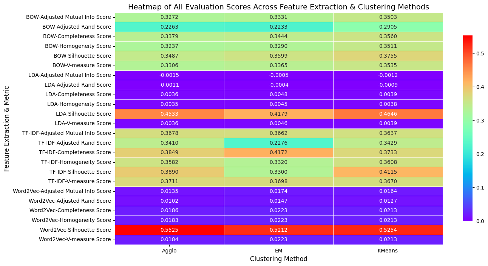

# Unsupervised Clustering of Semantically‑Related Books

This repository contains an end‑to‑end notebook that clusters short text records sampled from **five semantically related categories** (e.g., genres/authors/topics drawn from Gutenberg digital books). 

---

## What this project does

- **Corpus design — 5 × 200 records.** Build a corpus with **k = 5 categories** (e.g., five genres or five authors within a related theme). From each source set, randomly sample **200 documents** and extract a **~150‑word** record per document to standardize length.
- **Labels for comparison only.** Tag each record with labels **A–E** (by its source set). These labels are **not used to train** clusters, but later help us compare cluster assignments to the intended categories.
- **Preprocessing.** Lowercasing, punctuation/URL cleanup, tokenization, **stop‑word removal**, optional lemmatization/stemming, and discovery of **top collocations** (bigrams/trigrams) for later analysis.
- **Feature transformations.**
  - **Bag‑of‑Words** and **TF‑IDF** (configurable n‑grams).
  - **Topic distributions** via **LDA** (optional, for semantic factors).
  - **Embeddings** (optional): simple averaged word/sentence embeddings for semantic similarity.
- **Clustering algorithms.**
  - **K‑Means** (cosine or Euclidean distance on TF‑IDF / embeddings).
  - **Expectation–Maximization (EM)** via **Gaussian Mixture Models (GMM)**.
  - **Hierarchical** (Agglomerative) with Ward / average / complete linkage and cosine/Euclidean distance.
- **Evaluation & comparison.**
  - **Silhouette coefficient** (intrinsic cohesion/separation).
  - Agreement with labels A–E after **cluster‑to‑label alignment** (Hungarian matching or majority voting): **Cohen’s Kappa**, **purity**, 
- **Error analysis & insights.**
  - Inspect **misclustered** records, their **top 10 frequent words** and **top collocations**.
  - Analyze **which categories are most confusable** and **why** (shared jargon, style, authorial overlap).
- **Stress tests / robustness.**
  - Compare bias/variance behavior across features (TF‑IDF vs LDA vs embeddings) and algorithms (K‑Means vs GMM vs Hierarchical).


---

## Methods at a glance

- **Preprocessing:** cleanup → tokenization → stop‑words → (optional) lemmatization/stemming → collocations.
- **Features:** BoW / **TF‑IDF** (n‑gram control), **LDA** topic proportions, **embeddings** (averaged vectors).
- **Algorithms:** **K‑Means**, **GMM (EM)**, **Agglomerative**.
- **Metrics:** **Silhouette**, **Kappa** (after alignment), **purity**, **NMI/AMI** (optional), **topic coherence** (for LDA).
- **Visualization:** class/cluster distributions, **silhouette plots**, **t‑SNE/UMAP** of TF‑IDF/embeddings, **dendrograms** (hierarchical), **confusion heatmap** (clusters ↔ labels).


---

## Results snapshot (replace with your actual runs)



---

## Repository structure

```
.
├── Group_Project2_Clustering_Updated.ipynb
├── data/                 # For simplicity, sample data only provide 5 docs for each category
├── images/               # exported figures
└── README.md
```

---
